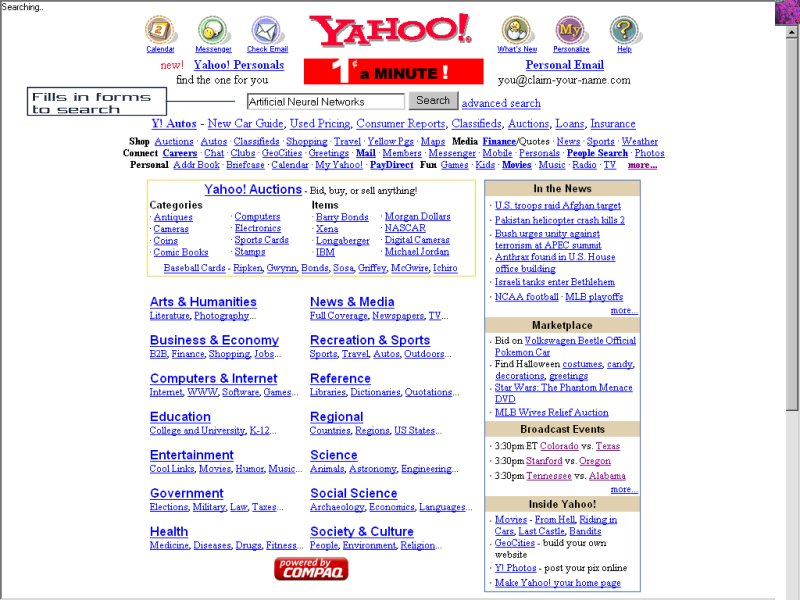



## AutoBrowser Screensaver \(No popups\)

### Description

This is an autobrowser screensaver. Basically you give it 4 topics, and it randomly chooses one and a search engine (google or yahoo). Then it searches for that, and randomly scrolls and clicks on links. Pretty cool and shows good manipulation of Web Browser control. It basically browses by itself, just surfing the net. Now there are no popups when it surfs. Kinda fun to just sit and watch it surf. Also plays a pretty cool wav while surfing.
 
### More Info
 
Must be connected to internet

None?

             |
---                |---
**Submitted On**   |2001-10-21 11:26:34
**By**             |[Daniel Smith \(SqueakMac\)](https://github.com/Planet-Source-Code/PSCIndex/blob/master/ByAuthor/daniel-smith-squeakmac.md)
**Level**          |Intermediate
**User Rating**    |4.5 (18 globes from 4 users)
**Compatibility**  |VB 6\.0
**Category**       |[Internet/ HTML](https://github.com/Planet-Source-Code/PSCIndex/blob/master/ByCategory/internet-html__1-34.md)
**World**          |[Visual Basic](https://github.com/Planet-Source-Code/PSCIndex/blob/master/ByWorld/visual-basic.md)
**Archive File**   |[AutoBrowse3022010212001\.zip](https://github.com/Planet-Source-Code/daniel-smith-squeakmac-autobrowser-screensaver-no-popups__1-28299/archive/master.zip)

